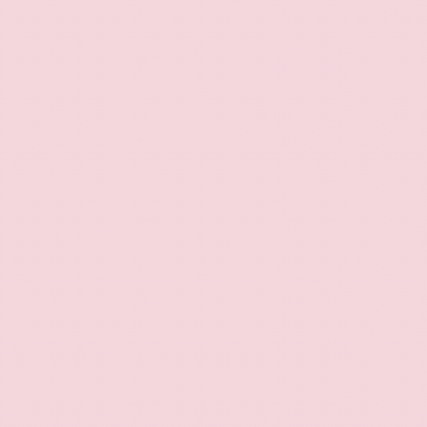
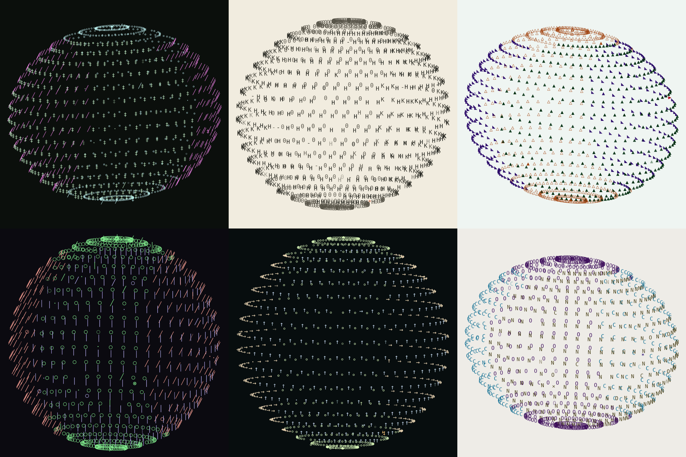
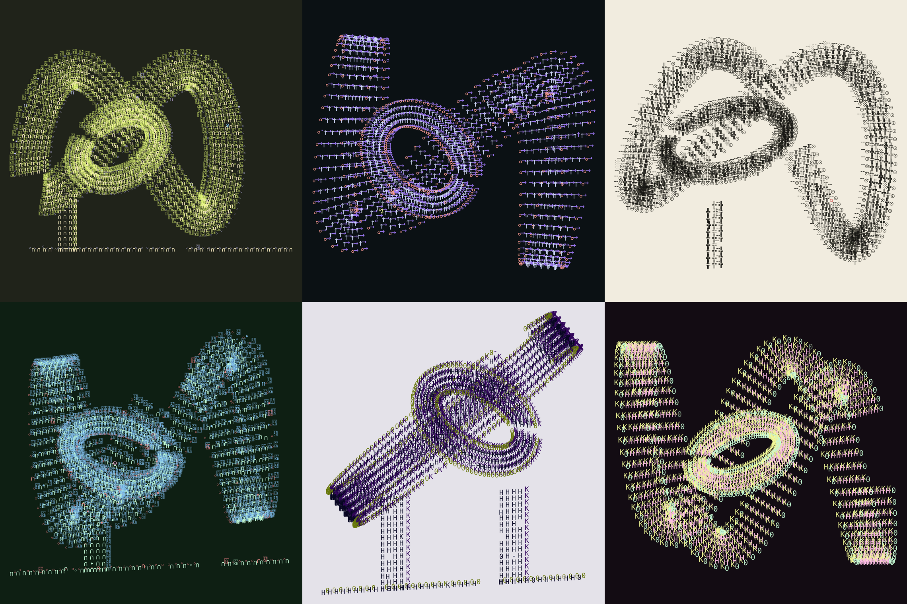
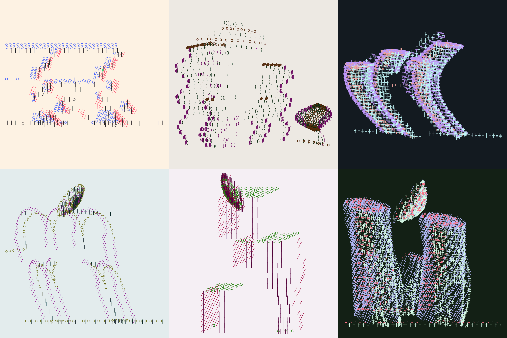
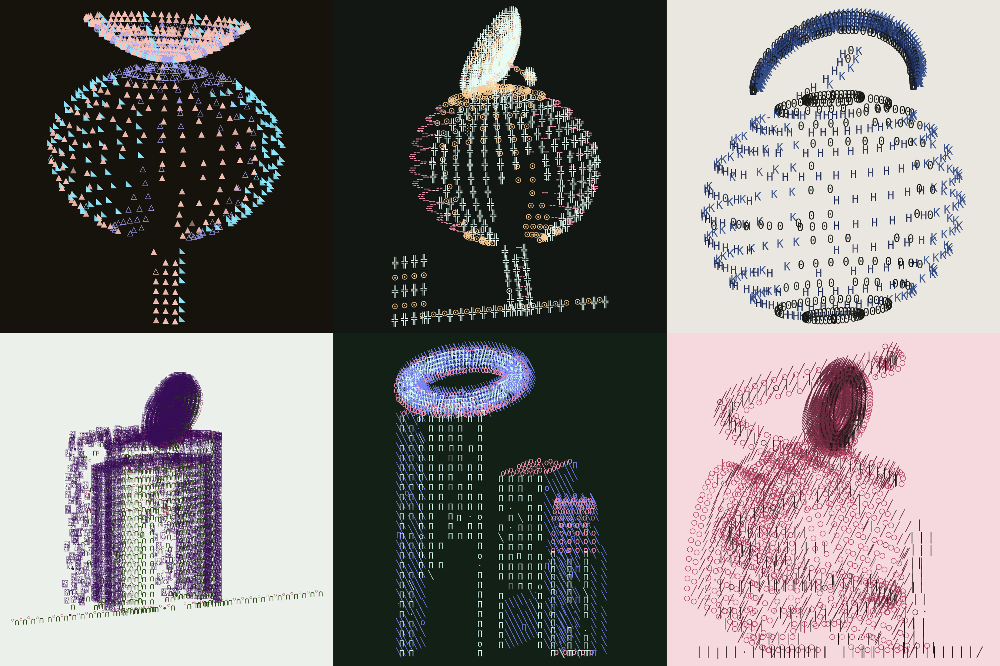
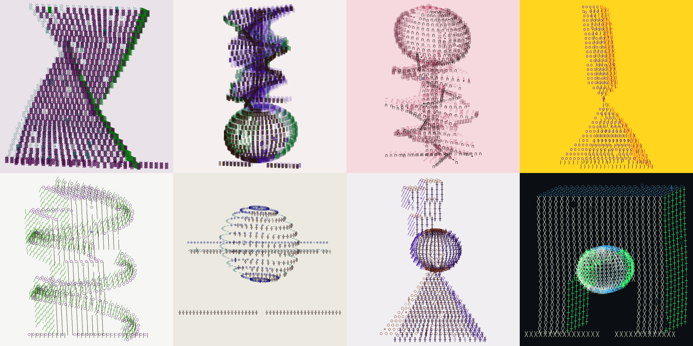

# ESPACIO ESCULTÓRICO — edición Verse

Adaptación de [`arquitecturasunicode`](../) al formato de token generativo de
[**generative-verse**](https://docs.verse.works/docs/projects/generative-verse/).
Mismo motor (`rng` + `corpus` + `architecture`), otra piel.



[Vista fija de esfera monumental](preview.png)

## v0.21 — el alfabeto respeta el grosor del cuerpo, y entra el hipar de Candela

Hasta ahora la semilla elegía el alfabeto del catálogo entero, sin mirar sobre
qué cuerpo iba a escribir. Y no todo signo sirve para todo cuerpo: una casilla
`□` o un triángulo `▲` —glifos macizos— **se empastan sobre una torre
helicoidal, una cinta o una celosía** hasta borrar la figura delgada; una
cornisa plana no arma volumen si el cuerpo tampoco lo trae. Esta versión pone
límites.

**Cada alfabeto se etiqueta con dos rasgos** (`corpus.js`): su *cuerpo* —cuánta
mancha ocupa el glifo: `MACIZO`, `MEDIO` o `FINO`— y su *profundidad* —si las
tres caras leen un volumen o son planas—. Cada forma, a su vez, declara un
*grosor*: `DELICADA` (torre helicoidal, cinta, celosía, espiral, hiperboloide,
serpiente, hipar…), `MACIZA` (esfera, pirámide, cubo, zigurat, masa arqueada…)
o `MEDIA`. El motor (`pickAlphabet`) cruza ambos antes de que la semilla elija:

- sobre un cuerpo **delicado** se prohíben los alfabetos macizos —que lo
  empastarían— y los planos —que no tendrían de dónde colgar la profundidad—;
- sobre un cuerpo **medio** se admite cualquier grosor, pero no la grafía plana;
- sobre un cuerpo **macizo** cabe todo, incluida la cornisa plana, porque el
  volumen ya lo pone la forma.

Así se cumple la regla que faltaba: **una grafía sin profundidad —dos ménsulas
juntas no hacen relieve— sólo se admite cuando la forma ya trae el suyo**. El
cambio es quirúrgico: la elección del alfabeto sigue siendo una sola extracción
del stream, así que **ninguna otra decisión de la semilla se mueve**; sólo
cambia de qué lista se extrae.

**Seis alfabetos nuevos**, todos verificados en la cadena `Apricot → Symbola`
sin fuente nueva, amplían el registro de grosor y de profundidad:

- **PUNTOS** — `⡇ ⢸ ⠉` (Braille): traza fina que dibuja lo delgado;
- **CIRCUITOS** — `⊞ ⊠ ⊡` (Squared Operators): módulo electrónico con relieve;
- **ESTELAR** — `✦ ✧ ∗` (Dingbats): constelación de caras llena / vacía / mínima;
- **HEXÁGONOS** — `⬢ ⬣ ⬡`: panal de caras contrastadas;
- **SILLARES** — `▨ ▧ ▤`: mampostería pesada, hermana de la casilla (macizo);
- **MÉNSULA** — `⌜ ⌐ ▔`: la única grafía **plana** —cornisa sin canto— que la
  gramática restringe a los cuerpos macizos.

La pieza pasa de **18 a 24 alfabetos**. Los **signos forasteros aparecen más**:
la intrusión sube del 46% al **56%** de las piezas y escala hasta 16 signos; la
grafía exótica del 11% al **13.5%**; y entra un pozo nuevo de **signos
geométricos y técnicos** (rueda dentada `⌘`, panal `⬡`, sello `❖`, cristal `⧫`)
que se cuelan como intrusión culta, a veces con el color que no existe en la
página. Los alfabetos jeroglíficos también crecen con más codepoints
verificados.

**Entra una forma nueva: HIPAR**, el paraboloide hiperbólico —el cascarón de
Félix Candela—. Es la deuda con los cascarones de Ciudad Universitaria: los
Rayos Cósmicos de Candela conviven con el Espacio Escultórico de Goeritz, así
que el hipar entra por el mismo parentesco que la serpiente. Es una superficie
anticlástica y **doblemente reglada** (`z = a·u·v`): dos familias de rectas la
generan, y cada carácter se asienta según la pendiente local —como en la onda
estacionaria—, de modo que frente, lateral y cubierta emergen de la curvatura y
no de un macizo. Alterna la **silla de montar** (un solo paño) y el **paraguas**
(cuatro cuadrantes que suben del mástil central a las cuatro esquinas). Entra de
las dos maneras prometidas: **de ella sola**, como ensamblaje escultórico
autónomo —**HIPAR MONUMENTAL**, un cascarón enorme que flota sin suelo—, y **en
conjunto**, como estructura de la gramática, cuerpo delgado de una genealogía.
Por delgado, nunca recibe un alfabeto macizo. La gramática llega a **34
estructuras** y los ensamblajes escultóricos a **12**.

## v0.20 — la pieza ocupa el cuadro, y los signos forasteros se dejan ver

Dos correcciones de escala y una de frecuencia.

**Las piezas se veían pequeñas, y la culpa era del suelo.** La línea de tierra se
calculaba sobre el ancho nominal multiplicado por 2.1 y siempre centrada en
cero, así que en el **72%** de las piezas con suelo sobresalía del edificio
—hasta 2.66 veces su ancho—. Al reencuadrar, el cuadro lo llenaba el suelo y la
arquitectura quedaba diminuta en medio. Ahora el suelo acompaña al cuerpo: se
centra en él y lo desborda apenas lo justo para leerse como línea de tierra. El
mismo error tenían el pedestal del obelisco y el suelo del lazo, centrados en
cero aunque sus cuerpos vivan desplazados.

El **anexo media luna** se acerca al edificio. Conserva su tamaño —eso fue
deliberado en v0.14— pero deja de alejarse hasta un tercio del ancho, que era lo
que empujaba el encuadre a lo ancho.

La especie **espera** es un díptico y su vano lo dicta el poema: «distancia»,
«ausencia» lo abren. No se recorta; en cambio la pareja **crece en alto a medida
que se separa**, así que conserva su sentido sin volverse una tira horizontal.

En una auditoría de 2,500 semillas, las piezas que ocupaban menos del 45% de su
eje corto pasan de **3.3% a 1.2%**. Por especie, la genealogía sube su mediana de
0.78 a 0.82 y espera —la más achatada— de 0.63 a 0.76, con sus casos extremos de
11% a 1.8%.

**Los signos forasteros aparecen más.** Eran demasiado escasos para notarse:

| | antes | ahora |
|---|---|---|
| piezas con intrusión | 30% | 46% |
| grafía exótica (una cara entera) | 4% | 11% |
| signos foráneos por pieza | hasta 5 | hasta 12, y escalan con el tamaño |

Siguen siendo minoría —esa es su gracia—, pero ahora una serie los muestra en
vez de esconderlos.

## v0.19 — la serpiente de Goeritz y dos alfabetos del pliegue

Entra **SERPIENTE**: el plano plegado. Viene de «La serpiente de El Eco»
(Mathias Goeritz, 1953) y de la familia de zigzags que siguió —una lámina
continua doblada en picos y valles, parada de canto, cuyo borde superior dibuja
una silueta de montaña—. La deuda no es casual: esta pieza se llama ESPACIO
ESCULTÓRICO por el de Ciudad Universitaria, que Goeritz hizo con Helen
Escobedo, Manuel Felguérez, Hersúa, Sebastián y Federico Silva.

Encaja en este motor mejor que ninguna otra forma, por un accidente feliz: la
lámina alterna la orientación de sus paños en cada pliegue, y esa alternancia es
exactamente el reparto frente/lateral con que la pieza reparte sus signos. Donde
la escultura real muestra una cara iluminada y la siguiente en sombra, aquí
cambia el carácter. El pliegue no se simula: se hereda.

Con ella llegan dos **alfabetos del plano plegado**, hermanos suyos:

- **CUÑA** — `◣ ◥ ▔ · ◆`
- **QUEBRADA** — `∧ ╲ ‾ · ∨`

Su lógica es distinta a la de los dieciséis anteriores. En vez de signos que
rellenan un volumen, aquí cada carácter *ya es* media casilla partida en
diagonal: el glifo trae la arista y el cambio de plano, así que frente y lateral
se leen como dos caras de un mismo doblez. Ambos se arman con bloques Unicode ya
presentes en la pieza —Geometric Shapes, Block Elements, Box Drawing y
Mathematical Operators—, de modo que no hace falta ninguna fuente nueva: se
verificó que los diez glifos se dibujan en la cadena real Apricot → Symbola.

La gramática llega a **33 estructuras** y la pieza a **18 alfabetos**.

## v0.18 — la cinta de una sola cara, y las últimas especies entran

Termina el cruce empezado en v0.16. Las cuatro formas que quedaban fuera —las
que traían sus propios pilares y su línea de suelo, y trabajaban en coordenadas
globales— se reescriben con el patrón del nudo y entran a la gramática:
**DOBLE HÉLICE**, **CÁPSULAS ENLAZADAS**, **ESPIRAL ATRAVESADA** y **ESFERA
HABITABLE**. Conservan sus pilares, que son parte del cuerpo, pero renuncian al
suelo propio: en la gramática lo pone la arquitectura.

Y nace una figura que no existía en ninguna especie: **MÖBIUS**.

Es una cinta cerrada con medio giro —una superficie de una sola cara— y entra
por una razón que es de esta pieza y no de otra: todo el motor reparte cada
signo entre tres caras, frente, lateral y cubierta, y esta es la única forma del
catálogo que niega esa premisa. Recorriéndola, la cara que empezó siendo frente
termina siendo lateral sin haber cruzado un borde. El giro no se dibuja: se
consigue rotando la sección transversal a lo largo del recorrido, así que el
borde interior sale convertido en exterior. Una de cada cuatro veces da tres
medias vueltas en lugar de una, y suele apoyarse en un fuste.

La **ESFERA HABITABLE** necesitó además una corrección de densidad: dentro de la
gramática es bastante menor que la especie no euclidiana, y con su retícula fija
de 21 × 38 los signos se encimaban hasta volverla una mancha maciza. Ahora la
resolución sigue al radio —el mismo remedio que se aplicó a la aureola en
v0.15—, y vuelven a verse el portal y la habitación interior.

Con esto la gramática llega a **32 estructuras**. El barrido de la línea de
suelo de las esferas pasa a medirse sobre una muestra propia de 12,000 semillas:
antes dependía de las pocas esferas que cayeran en el barrido general —a veces
menos de cincuenta— y el resultado oscilaba por muestreo y no por el motor. El
umbral es el mismo.

## v0.17 — seis cuerpos más entran en la genealogía

Continúa el cruce que empezó v0.16. Seis formas que existían solamente como
morfologías de la especie «espera» pasan a ser también **estructuras de la
gramática**, es decir, cuerpo de una arquitectura con planta, vacío, cubierta,
anexo y deformación:

**ANILLOS**, **TÓTEM**, **VÓRTICE**, **HIPERBOLOIDE**, **VOLADIZOS** y
**ESPIRAL**.

Cinco de ellas ya aceptaban el mismo `spec` que el resto de la gramática, así
que entraron sin adaptación. La **ESPIRAL** trabajaba en otro sistema —centro y
radio en vez de origen y ancho—: un adaptador (`addSpiralBody`) traduce el spec
y le añade el zócalo, para que emita frente, lateral y cubierta como cualquier
otro cuerpo.

Sobre los nombres: **ANILLOS** va en plural porque `ANILLO` ya es una *planta* y
`ANILLO SUPERIOR` una *cubierta* —huella, cuerpo y remate son tres cosas
distintas—. Lo mismo separa **VOLADIZOS** (cuerpo apilado en cantiléver) de la
cubierta `VOLADIZO` (una sola losa que sobresale).

Con esto la gramática pasa de 18 a **27 estructuras**. Los pesos de las familias
principales se dejaron intactos: las seis nuevas entran con pesos moderados
(5 a 9) para no diluir a las que ya sostenían la serie.

## v0.16 — el catálogo entero entra en la genealogía

Hasta ahora había dos mundos separados: las **especies autónomas** (onda, nudo,
lazo, esfera habitable) y las **arquitecturas con genealogía**, que sólo podían
armarse con un vocabulario cerrado de estructuras. Esta versión los cruza en
tres direcciones.

- **Onda, nudo y lazo se vuelven estructuras de la gramática.** Ya no viven
  únicamente como pieza suelta: pueden ser el cuerpo de una genealogía, con su
  planta, su vacío, su cubierta, su anexo y su deformación, igual que una esfera
  o una zigurat. El nudo de losas se reescribió para aceptar el mismo `spec` que
  las demás estructuras, en vez de trabajar en coordenadas globales.
- **La onda y el nudo pueden ser capitel del arco.** Dos cubiertas nuevas —**ONDA
  SUSPENDIDA** y **NUDO SUSPENDIDO**— posan el cuerpo escultórico sobre el vano
  en lugar de cerrarlo. Entran con preferencia cuando hay masa arqueada o vacío
  de arco, pero sin quitarle sitio al motivo arco + anillo superior, que sigue
  siendo recurrente.
- **La parabólica sale sola y monumental.** Antes desaparecía si no había
  edificio que coronar; ahora **PARABOLOIDE MONUMENTAL** es un ensamblaje
  escultórico por derecho propio: un solo paraboloide enorme, sin mástil ni
  línea de suelo, inclinado en el aire y ocupando todo el cuadro.

La **media luna** recibe un segundo adelgazamiento —tres bandas en vez de
cuatro, menos espesor, menos profundidad y menos muestras—: vuelve a ser una
línea curva y no una tajada maciza.

## v0.15 — la aureola se afina, la media luna gira y entra la voluta

Tres correcciones sobre las cubiertas curvas, a partir de cómo se veían de
verdad al dibujarse:

- **ANILLO SUPERIOR** (la aureola) se leía como un disco macizo: seis bandas por
  tres profundidades por noventa y seis muestras llenaban por completo la
  argolla. Ahora el trazo se adelgaza —tres bandas, una sola profundidad y un
  muestreo proporcional al perímetro de la elipse— para que vuelva a verse el
  hueco del anillo, con aire entre los signos, como ya ocurría en la cúpula y en
  el halo. Es un trazo dibujado, no una mancha.
- La **MEDIA LUNA INVERTIDA** dejaba de girar: siempre era el mismo arco ∩
  mirando hacia arriba. Ahora la semilla la voltea y la gira —**cuenco** (∪),
  **de costado** (C / Ɔ) o en **giro libre**— y el apoyo se decide según la
  orientación (cuernos sólo cuando abre hacia arriba; mástil central o flotante
  cuando está volteada) para que ningún cuerno apunte al vacío. Su espesor
  también se aligera un poco.
- Entra una cubierta nueva, la **VOLUTA**: un solo trazo en espiral —el rollo
  jónico, el caracol— que se enrosca sobre el edificio. Por ser una línea
  continua y delgada se lee clara en solitario y no compite con la masa cuando
  acompaña a otra genealogía. Aparece a la izquierda, a la derecha, **doble** en
  espejo o flotante. Es el reverso exacto del anillo macizo.

## v0.14 — caracteres de paisaje, onda estacionaria y loops mezclados

Entran cuatro fuentes de la carpeta `paisaje` —**ELECTRONICS**, **jeroglíficos
egipcios**, **jeroglíficos anatolios** y **Lineal B**— pero no como una paleta
más: llegan por dos caminos deliberadamente escasos.

- **Intrusión** (≈30% de las semillas): un puñado de signos que no pertenecen a
  la paleta se cuelan en la pieza. Unas veces es un jeroglífico o un símbolo
  electrónico —con su propia fuente—; otras, un *block element* pintado con un
  **color que no existe en la página** (el matiz más lejano a toda la paleta).
  Es puntual, no una lluvia: nunca más de cinco signos.
- **Grafía exótica** (≈4% de las semillas): muy rara vez, una cara entera de la
  pieza deja de ser tipográfica y se vuelve jeroglífica o electrónica. Justo
  porque casi no se selecciona, cuando aparece es exclusiva.

Nace una figura escultórica nueva: **ONDA ESTACIONARIA**. Una membrana grande
que vibra en un modo propio (patrón de Chladni): crestas y valles fijos, líneas
nodales planas. No vive plana ni clavada al suelo: **cabecea y gira** libremente,
y los mástiles son una posibilidad —no una obligación—, así que la mayoría de
las veces simplemente flota y ocupa casi todo el cuadro. Los signos se montan
sobre la superficie; frente, lateral y cubierta emergen de la pendiente local,
no de un volumen macizo.

La **ANTENA PARABÓLICA** puede volverse **monumental**: a veces el paraboloide
desborda el ancho del edificio y recibe más anillos para no perder densidad.

Los **loops dejan de vivir sólo en la especie entrelazada**. El toro tejido del
LAZO HABITABLE regresa como ensamblaje escultórico —**LAZO ATRAVESADO**— donde
una esfera lo cruza por el centro. Así los loops se mezclan con esferas, ondas y
cubos, como los círculos y anillos de las demás composiciones.

La **ménsula ya no aparece sola**: cuando su genealogía iba a quedarse sin
cubierta ni anexo, recibe una compañera —a menudo la propia media luna. Y la
**MEDIA LUNA sale de la corona**: un nuevo anexo la coloca de costado, a media
altura, sostenida por su cuerno o flotando. Ahora se la ve en otras posiciones,
no sólo coronando —y ahora aparece con más frecuencia y más grande para que se
la vea de verdad.

## v0.12 — cuerpos autónomos y tres manifiestos

Regresa la esfera grande como una especie propia: **ESFERA MONUMENTAL**. Es un
solo cuerpo cerrado, de detalle alto, sin eje horizontal, pedestal ni línea de
suelo. En la auditoría de 2,000 semillas apareció 69 veces; **ESFERA
ATRAVESADA** y su eje horizontal salen por completo del catálogo actual.



**LAZO HABITABLE** deja de repetir una composición central. La semilla elige
entre seis emplazamientos —centro, ambos laterales, suspendido, diagonal o
expulsado—; tres leyes —órbita, ocho o triple pliegue—; y cuatro apoyos —doble,
izquierdo, derecho o flotante—. Su habitación interior también deriva respecto
del lazo exterior y la línea de suelo se vuelve minoritaria.



La **ANTENA PARABÓLICA** pierde mástil, brazo focal y receptor. Queda únicamente
el paraboloide tipográfico: una superficie inclinada que puede posarse o flotar
sobre la arquitectura.

Comienza además una gramática de lenguajes que modifica realmente los puntos,
no sólo el metadato:

- **EXPRESIONISMO MODERNO**: empuje vertical, curvatura emotiva y ensanchamiento;
- **DECONSTRUCTIVISMO**: el edificio se divide en cuatro a siete bandas
  desplazadas, levantadas y cizalladas de manera independiente;
- **PARAMETRISMO**: dos a cuatro campos continuos ondulan posición, profundidad
  y altura;
- **SIN MANIFIESTO** conserva la geometría directa y evita que estas escuelas
  dominen toda la serie.



## v0.11 — la cubierta deja de ser una conclusión

La parte superior se convierte en una segunda gramática escultórica. Tres
cubiertas nuevas entran en las genealogías:

- **CÚPULA INVERSA**: un cuenco 3D cuyo centro puede tocar el edificio, colgar
  de dos tensores, apoyarse en un mástil lateral o desafiar la gravedad;
- **MEDIA LUNA INVERTIDA**: un arco lunar de espesor variable, sostenido por
  cualquiera de sus cuernos, por un mástil excéntrico o por nada;
- **ANTENA PARABÓLICA**: paraboloide inclinado con profundidad, mástil, brazo
  focal y receptor.



`ANILLO SUPERIOR` ya no implica dos apoyos simétricos. Puede descansar sobre
**dos pilares, un mástil central, un mástil izquierdo, un mástil derecho o un
trípode oblicuo**. La variante queda registrada en la ficha y en los features
de Verse.

`ESFERAS` combina con especial frecuencia estas cuatro cubiertas. Además, su
línea de suelo deja de ser obligatoria: en la auditoría de 2,000 semillas,
aproximadamente **71% de las arquitecturas esféricas quedaron libres de suelo**.
En esa misma muestra aparecieron 114 cúpulas inversas, 81 medias lunas y 105
antenas parabólicas. La antigua CÚPULA INVERSA no desaparece de la familia no
euclidiana; ahora también puede coronar cualquier genealogía.

## v0.10 — toda la pantalla pertenece a la escultura

El colofón deja de ocupar la franja inferior. La arquitectura se reencuadra
ahora dentro de un campo de **924 × 924 px** —antes 844 × 764— y puede crecer
hasta 3.75 veces respecto a sus coordenadas de origen. Las piezas verticales
ganan cerca de **21% de altura útil**.

Título, frase, forma, alfabeto, color, perspectiva, duración y semilla pasan a
una ficha HTML bajo demanda. Se abre con la tecla `i` o con el punto sensible
inferior derecho y se cierra con `Esc`. Tanto `i` como `GIF` son invisibles
mientras se escribe y cuando no tienen foco o cursor.

La ficha no pertenece al SVG. Tampoco aparece en la captura final ni en el GIF:
las tres superficies conservan únicamente papel y signos. Los datos continúan
disponibles para Verse mediante `window.$artifact.features` y para tecnologías
de asistencia mediante el título y la descripción del SVG.

## v0.9 — el edificio se convierte en espacio escultórico

La pieza cambia de nombre y de escala conceptual. **ESPACIO ESCULTÓRICO** ya no
combina solamente plantas, estructuras y cubiertas: ensambla cuerpos autónomos
que pueden apoyarse, atravesarse, orbitar o mantenerse en un equilibrio
improbable.

Una sexta especie ocupa aproximadamente **18%** de las semillas y produce ocho
relaciones:

- **ESFERA SOBRE HÉLICE** y **HÉLICE SOBRE ESFERA**;
- **OBELISCO ROTO**, con una pirámide y un fuste invertido tocándose en la punta;
- **PIRÁMIDES INTERPENETRADAS**;
- **ESFERA ATRAVESADA** por un eje horizontal;
- **CUBOS EN ESPIRAL**;
- **ARCO CON CUERPO SUSPENDIDO**;
- **EQUILIBRIO DE TRES CUERPOS**: pirámide, esfera y cubo.



ESFERA, PIRÁMIDE y OBELISCO ROTO también entran en las arquitecturas de
genealogía y en los edificios que se esperan. La TORRE HELICOIDAL gana peso
generativo. La esfera grande deja de depender únicamente de la rara familia no
euclidiana.

La cubierta puede ser **NINGUNA**. En la auditoría de v0.9 aparece en cerca de
29% de las genealogías; anillo, cúpula y corona juntos quedan por debajo de 36%.
Siguen siendo posibles, pero ya no concluyen automáticamente las formas.

Al final del colofón aparece un vínculo casi invisible: `GIF ↘`. Reconstruye la
coreografía determinista de la semilla, codifica entre 18 y 34 cuadros de
600 × 600 px dentro del navegador y descarga el resultado. No graba la pantalla
ni usa un servidor. El codificador local es
[`gifenc`](https://github.com/mattdesl/gifenc), distribuido bajo licencia MIT.

## Qué cambia respecto a la versión vertical

| | versión vertical (`../`) | edición Verse (esta carpeta) |
|---|---|---|
| **Formato** | lámina 900 × 1200 (retrato) | **cuadrada 1000 × 1000**, a sangre en cualquier viewport |
| **Interfaz** | cabecera, panel, botones, exportaciones, teclas | sólo la obra; `i` y `GIF` aparecen al buscar el borde inferior derecho |
| **Semilla** | `?seed=` en la URL + botón «otra arquitectura» | **hash inyectado por Verse** (`?payload=base64(JSON)`) |
| **Datos de la pieza** | ficha en el panel lateral (HTML) | **ficha HTML bajo demanda, fuera del SVG y del GIF** |
| **Serie / edición** | — | **no se imprime**: la administra Verse (sí va en los `features`) |
| **Rasgos** | `dl` en el DOM | `window.$artifact.features` para el metadato del token |

La computadora sigue decidiéndolo todo: especie, frase, masa, vacío,
perspectiva, temperatura, error, morfología, alfabeto, color, copia carbón y
anomalía. La misma semilla reconstruye exactamente el mismo espacio.

## v0.8 — la computadora escribe el edificio

La arquitectura ya no aparece terminada: se escribe como una coreografía de
signos. No avanza línea por línea. **Frente, profundidad y cubierta** son tres
familias tipográficas con recorridos diferentes y ventanas temporales que se
solapan: el frente tiende a crecer desde el suelo, los laterales cruzan el
volumen en diagonal y las cubiertas recorren curvas y coronas.

El ritmo también pertenece a la semilla. Alterna ráfagas y respiraciones, y la
duración total varía entre aproximadamente **2.4 y 8.2 segundos**; nunca baja de
dos segundos. Entre 2.5% y 14% de los signos pueden cometer una equivocación
transitoria: aparece otro carácter de la paleta, queda un vacío breve como
backspace y finalmente regresa el signo correcto. Estos tropiezos performativos
no sustituyen los errores estructurales permanentes de la pieza.

Un único `requestAnimationFrame` administra todos los eventos, incluso cuando
hay miles de glifos. Verse recibe `verse:ready` y `fxpreview()` solamente después
de la última corrección, para que la miniatura capture el edificio completo.
`?still=1` o la preferencia `prefers-reduced-motion` muestran inmediatamente el
estado final.

## v0.7 — genealogías de color y pisos que giran

El color dejó de depender solamente de un catálogo cerrado. En aproximadamente
**72%** de las semillas, tres valores HSL originan una genealogía cromática
determinista inspirada en el sistema de [`canekzapata/fonts`](https://github.com/canekzapata/fonts):
los colores hijos derivan recursivamente de un matiz padre y pueden saltar 120°,
180° o permanecer incómodamente cerca. El 28% restante conserva las paletas
editadas de versiones anteriores.

Hay seis leyes: **RECURSIVA, COMPLEMENTARIA BRUSCA, TERMINAL ÁCIDA, TRÍADA
ELÉCTRICA, ARCHIVO MUTANTE** y **ANÁLOGA TENSIONADA**. Frente y fondo mantienen
contraste fuerte; laterales y cubiertas tienen un umbral propio para que el
volumen siga siendo legible. Esto permite miles de combinaciones, incluidos
los encuentros violentos de neón sobre fondos casi negros y tinta oscura con
caras súbitamente eléctricas sobre papel.

Dos nuevas estructuras amplían el vocabulario 3D:

- **TORRE HELICOIDAL**: entre 16 y 27 losas habitables giran alrededor de un
  núcleo; la cintura se contrae y expande mientras asciende.
- **CUBOS ENCAJADOS**: masas voxeladas de proporción cúbica se apilan e
  interpenetran, dejando visibles frente, profundidad y cubierta.

Las **ZIGURATS no fueron eliminadas**: siguen existiendo en las dos especies
arquitectónicas y recuperan peso generativo junto con las espirales.

## v0.6 — el arco entra en la gramática

La pieza ahora privilegia la arquitectura volumétrica: aproximadamente **78%**
de las semillas construyen una genealogía de planta + estructura + vacío +
cubierta + anexo + deformación. La vista casi frontal sigue siendo posible,
pero rara (cerca de 2.5%).

El arco ya no pertenece solamente a la especie voxelar aislada. **MASA
ARQUEADA** excava un vano dentro de un cuerpo con frente, profundidad y techo;
puede combinarse con cualquier planta, deformación y anexo. **ANILLO SUPERIOR**
es una cubierta vertical gruesa con dos apoyos que llegan físicamente a la
estructura. Cuando ambos genes coinciden aparece, por fin, el arco con anillo
arriba como motivo recurrente.

También se incorporan **ROTONDA**, **CRUJÍAS PARALELAS** y **PUENTE HABITADO**.
Las familias más planas permanecen como accidentes poco frecuentes; arcadas,
bóvedas, ménsulas, masas arqueadas y rotondas llevan la mayor parte del peso.

## Cómo Verse entrega la semilla

Verse abre `index.html` dentro de un iframe con un `payload` en base64:

```js
const q = new URLSearchParams(location.search).get("payload");
const p = JSON.parse(q ? atob(q) : "{}");
const hash = p.hash;              // semilla determinista
const editionNumber = p.editionNumber;
```

`verse.js` lee ese hash, construye la pieza y la dibuja. Si no hay `payload`
(desarrollo local) genera un hash aleatorio para poder verla. Acepta también
`?hash=`, `?seed=` o `?fxhash=` como alternos.

## Probar en local

```bash
# desde la raíz del repo
python3 -m http.server 8080
```

- Con hash explícito (payload base64 de `{"hash":"loquesea","editionNumber":7}`):
  `http://localhost:8080/lasletras/?payload=eyJoYXNoIjoibG9xdWVzZWEiLCJlZGl0aW9uTnVtYmVyIjo3fQ==`
- Sin payload (hash aleatorio en cada recarga):
  `http://localhost:8080/lasletras/`

Pruebas estadísticas, cromáticas y temporales:

```bash
node lasletras/tests/smoke.js
node lasletras/tests/typewriter.js
node lasletras/tests/gif.js
node lasletras/tests/presentation.js
```

Para el `playground.html` de Verse, apunta el iframe a la URL de `index.html`.

## Rasgos publicados (`window.$artifact.features`)

`Especie`, `Forma`, `Alfabeto`, `Cuerpo del alfabeto`, `Grosor de la forma`,
`Color`, `Sistema cromático`, `Temperatura`, `Perspectiva`, `Volumen`,
`Estructura`, `Vacío`, `Cubierta`, `Lenguaje arquitectónico`, `Posición del
lazo`, `Escritura`, `Copia carbón`, `Intrusión`, `Grafía exótica` y `Anomalía`.
Verse los captura tras ejecutar el código y los incluye en el metadato de cada
edición.

## Reglas de token respetadas

- Sin recursos externos ni llamadas de red: motor y fuentes van en el bundle.
- Determinismo total a partir del hash (`xfnv1a` + `mulberry32`).
- Se adapta a cualquier tamaño de viewport (`viewBox` + `preserveAspectRatio`).
- La escritura comienza tras `document.fonts.ready`, para que no aparezcan
  signos de reserva. Al terminar la última corrección dispara `verse:ready` (y
  `fxpreview()` si existe).

## Formas nuevas (más variedad)

Además del reformateo, el motor ganó vocabulario geométrico y cromático:

- **VÓRTICE** — torre helicoidal que se estrecha al subir, con mástil central;
- **CELOSÍA / CELOSÍAS** — retícula de diagonales cruzadas (morfología de la
  especie *espera* y estructura de la especie *genealogía*);
- **HIPERBOLOIDE** — torre de cintura: dos anillos unidos por generatrices
  rectas que se cruzan y estrechan el talle (superficie reglada, tipo Shújov);
- **ZIGURAT / ZIGURATS** — cuerpo de retranqueos escalonados con terrazas
  (morfología de *espera* y estructura de *genealogía*);
- **ACUEDUCTO / ARCADAS** — arcada repetida de pilares y arcos de medio punto,
  uno o dos niveles (morfología de *espera* y estructura de *genealogía*);
- **VOLADIZOS** — losas en cantiléver apiladas que sobresalen alternando lados
  desde un núcleo central (brutalismo tipo jenga);
- **MÉNSULAS** — bóveda por aproximación de hiladas: cada curso voladiza hacia
  adentro hasta cerrar el vano (corbeling; morfología de *espera* y estructura
  de *genealogía*);
- **TORRE HELICOIDAL** — pisos rectangulares torsionados alrededor de un núcleo;
- **CUBOS ENCAJADOS** — cuerpos cúbicos interpenetrados con tres caras visibles;
- **CÚPULA INVERSA / MEDIA LUNA INVERTIDA / ANTENA PARABÓLICA** — cubiertas
  volumétricas que pueden coronar también esferas, arcos, hélices y obeliscos;
  la media luna gira ahora como cuenco, de costado o en giro libre;
- **VOLUTA** — cubierta de un solo trazo en espiral (rollo jónico / caracol),
  a la izquierda, a la derecha, doble en espejo o flotante;
- **ONDA / NUDO / LAZO como estructura** — los cuerpos que antes eran especies
  autónomas ahora pueden ser el cuerpo de una arquitectura con genealogía;
- **ANILLOS / TÓTEM / VÓRTICE / HIPERBOLOIDE / VOLADIZOS / ESPIRAL** — seis
  morfologías de la especie «espera» que ahora también son estructuras de la
  gramática;
- **DOBLE HÉLICE / CÁPSULAS ENLAZADAS / ESPIRAL ATRAVESADA / ESFERA HABITABLE**
  — las especies entrelazadas y no euclidianas, también como estructura
  (32 en total);
- **MÖBIUS** — cinta cerrada con medio giro: una superficie de una sola cara, la
  única forma del catálogo que contradice el reparto en tres caras;
- **SERPIENTE** — el plano plegado de Goeritz: lámina en zigzag parada de canto,
  cuyos paños alternos heredan el reparto frente/lateral;
- **HIPAR** — el paraboloide hiperbólico de Félix Candela: cascarón anticlástico
  doblemente reglado (silla de montar o paraguas), cuerpo delgado en la gramática
  y **HIPAR MONUMENTAL** como ensamblaje autónomo que flota sin suelo;
- 2 alfabetos del pliegue: **CUÑA** y **QUEBRADA**;
- **ONDA SUSPENDIDA / NUDO SUSPENDIDO** — capiteles escultóricos que se posan
  sobre el vano del arco en lugar de cerrarlo;
- **PARABOLOIDE MONUMENTAL** — la antena parabólica como pieza autónoma de gran
  escala, sin mástil ni línea de suelo;
- **ESFERA MONUMENTAL** — esfera autónoma de gran escala, cerrada y sin eje;
- **ONDA ESTACIONARIA** — membrana rectangular que vibra en un modo propio
  (patrón de Chladni), con líneas nodales planas y dos mástiles de apoyo;
- **LAZO ATRAVESADO** — el toro tejido del lazo habitable como ensamblaje
  escultórico, cruzado por una esfera (los loops mezclados con otros cuerpos);
- **LAZO HABITABLE LIBERADO** — seis emplazamientos, tres leyes de curva y
  cuatro condiciones de apoyo;
- 4 alfabetos: **BLOQUES, TRIÁNGULOS, FLECHAS, REDES**;
- 6 alfabetos nuevos, elegidos según el grosor del cuerpo: **PUNTOS** (Braille),
  **CIRCUITOS**, **ESTELAR**, **HEXÁGONOS**, **SILLARES** (macizo) y **MÉNSULA**
  (la única grafía plana, restringida a los cuerpos macizos) — 24 en total;
- 5 familias cromáticas nuevas: **SEPIA QUEMADO, BAUHAUS, RISO FLÚOR,
  VERDE FÓSFORO, MAGENTA CINTA**.

## Archivos

```text
lasletras/
  index.html         lámina cuadrada + ficha HTML bajo demanda
  js/verse.js        payload → build → reencuadre completo → escritura → features
  js/rng.js          copia del motor (xfnv1a + mulberry32)
  js/corpus.js       copia del motor (frases, alfabetos, color)
  js/architecture.js copia del motor (vóxeles, paramétricas, proyección)
  js/typewriter.js   horario y reproducción por familias de caracteres
  js/gif-export.js   reconstrucción canvas + descarga GIF de cada semilla
  vendor/            gifenc incluido localmente + licencia MIT
  fonts/             Apricot Portable + Symbola + paisaje (Electronics,
                     jeroglíficos egipcio/anatolio y Lineal B), todas en el bundle
  tests/             pruebas estadísticas, temporales, GIF y presentación
```
